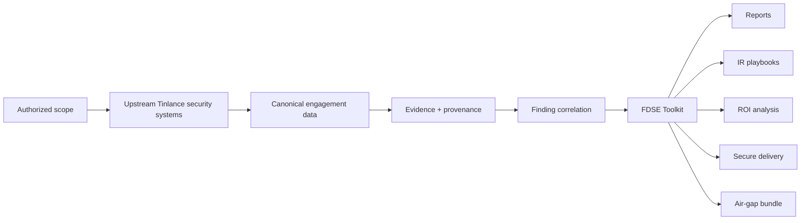

# Tinlance FDSE Toolkit

**Private field system for Forward-Deployed Security Engineering engagements — turning governed security evidence into defensible customer deliverables.**

[](https://github.com/LloydCoder/Tinlance-FDSE-toolkit/actions/workflows/fdse-ci.yml)
[](https://github.com/LloydCoder/Tinlance-FDSE-toolkit/actions/workflows/security.yml)
[](https://github.com/LloydCoder/Tinlance-FDSE-toolkit/actions/workflows/compatibility.yml)
[](https://github.com/LloydCoder/Tinlance-FDSE-toolkit/actions/workflows/release.yml)

## At a glance

The FDSE Toolkit is a **private operator system used by Tinlance Forward-Deployed Security Engineers** during authorized customer engagements. It packages and operationalizes outputs from upstream security systems into evidence-backed findings, reports, incident-response playbooks, business-impact analysis, secure delivery packages and offline artifacts.

> **Positioning:** this is a field-delivery system, not a customer SaaS, detection engine, compliance authority or autonomous execution platform.

### Architecture



The Tinlance Agent Platform remains the governed execution authority. The Toolkit does not duplicate identity, authorization, policy, approvals, runtime, sandbox, secrets, budgets, audit or observability authority.

## What it does

| Capability | Purpose |
|---|---|
| Canonical contracts | Validate engagement, evidence, finding, asset, incident, remediation, regulatory and ROI records |
| Evidence integrity | Preserve provenance, hashes and controlled evidence metadata |
| Finding correlation | Produce deterministic, traceable risk/finding relationships |
| Reporting | Generate PDF, DOCX and XLSX customer deliverables |
| Identity exposure | Perform bounded local credential/secret exposure scanning with redaction |
| Field scope | Keep operator workflows explicitly bounded by authorization and exclusions |
| IR playbooks | Generate scenario-specific incident-response material from observed inputs |
| ROI analysis | Calculate assumption-driven business impact with sensitivity analysis |
| Secure delivery | Build integrity-manifested packages with authenticated encryption |
| Air-gap delivery | Build and verify offline bundles |
| Operator CLI | Expose the maintained workflow through a bounded local command surface |
| Release evidence | Produce SBOM, dependency snapshot, hashes and tag-based provenance evidence |

## Quick Start

Requires Python 3.11 or newer.

```bash
python -m venv .venv
. .venv/bin/activate
python -m pip install --upgrade pip
python -m pip install .
fdse --help
```

Windows PowerShell activation:

```powershell
.venv\Scripts\Activate.ps1
```

For development dependencies, install the test and quality tools listed in `pyproject.toml` using your preferred environment manager.

## Installation

The supported source-package path is standard Python packaging:

```bash
python -m pip install .
```

For a development checkout:

```bash
python -m pip install -e .
```

The maintained compatibility gate currently exercises Linux, Windows and macOS with Python 3.11–3.14. Source compatibility does **not** by itself certify PyInstaller binaries or a specific air-gap workstation.

## Usage

Validate a canonical document:

```bash
fdse validate engagement ./engagement.json
fdse validate finding ./finding.json
fdse validate field-validation ./validation.json
```

Generate customer reports:

```bash
fdse report --engagement ./engagement.json --findings ./findings.json --output-dir ./reports
```

Generate an incident-response playbook:

```bash
fdse playbook --engagement ./engagement.json --incident ./incident.json --output ./playbook.md
```

Scan a local file for credential exposure:

```bash
fdse scan-file ./evidence.txt --output ./identity-findings.json
```

Build an authenticated delivery package:

```bash
fdse package --artifact report.pdf ./reports/report.pdf --output-zip ./delivery.zip --encrypted-output ./delivery.enc --password 'use-a-controlled-secret'
```

Build or verify an air-gap bundle:

```bash
fdse airgap --build-from ./delivery --output ./airgap.zip
fdse airgap --verify ./airgap.zip
```

Do not run field collection or scanning against customer or third-party infrastructure without explicit authorization and a documented scope.

## Configuration and operating boundaries

The Toolkit is intentionally local and bounded.

- **Authorization:** must already exist before field activity.
- **Scope:** targets and exclusions are recorded by the engagement; discovery must never expand scope.
- **Evidence:** material findings must retain provenance and traceability.
- **Secrets:** real credentials and customer evidence must never enter tests, logs or this public repository.
- **Execution authority:** governed execution remains in the Tinlance Agent Platform.
- **Network authority:** the Toolkit does not grant arbitrary network or customer-code execution authority.
- **Delivery:** encryption and manifests protect the generated package; transfer channels and passwords remain operational responsibilities.
- **Offline use:** air-gap verification must succeed without relying on a live service.

## Documentation

Start here:

- [Repository map](docs/repository-map.md)
- [Field validation standard](docs/field-validation-standard.md)
- [Field pilot runbook](docs/field-pilot-runbook.md)
- [Claims register](docs/claims-register.md)
- [Final forensic audit](docs/final-forensic-audit.md)
- [Enterprise release gate](docs/enterprise-release-gate.md)
- [Operator CLI](docs/phase-20-operator-cli.md)
- [Adversarial hardening](docs/phase-21-adversarial-hardening.md)
- [Compatibility](docs/phase-22-compatibility.md)
- [Continuous compatibility](docs/phase-24-continuous-compatibility.md)

### Documentation map

| Need | Start with |
|---|---|
| Understand the repository | [Repository map](docs/repository-map.md) |
| Operate the Toolkit | [Field pilot runbook](docs/field-pilot-runbook.md) |
| Understand validation status | [Field validation standard](docs/field-validation-standard.md) |
| Check product claims | [Claims register](docs/claims-register.md) |
| Understand security/release boundaries | [Final forensic audit](docs/final-forensic-audit.md) |
| Use the CLI | [Operator CLI](docs/phase-20-operator-cli.md) |
| Understand supported source platforms | [Compatibility](docs/phase-22-compatibility.md) |

## Validation status

The project uses evidence-based release states:

**ENGINEERING-READY → SYNTHETIC-VALIDATED → FIELD-PILOTED → FIELD-PROVEN → PRODUCTION-CERTIFIED**

The maintained engineering gates are automated. A green CI run is necessary but not sufficient for field or production certification. No blanket "100% bug-free" claim is made.

The current repository includes the Phase 25 field-validation contract and pilot runbook. A real customer pilot has **not** been represented as completed merely because engineering CI is green.

## Relationship to the Tinlance ecosystem

The Toolkit is a downstream field-delivery layer. It can consume structured outputs from systems such as:

- [Tinlance Agent Platform](https://github.com/LloydCoder/tinlance-agent-platform) — governed execution authority
- [Tinlance FDSE](https://github.com/LloydCoder/tinlance-fdse) — engineering-domain execution
- [ThreatFade](https://github.com/LloydCoder/threatfade) — security analysis ecosystem component
- [ReconOS](https://github.com/LloydCoder/reconos) — reconnaissance/intelligence ecosystem component
- [BugFlow](https://github.com/LloydCoder/bugflow) — findings/engineering workflow component
- [FAS](https://github.com/LloydCoder/fas) — evidence-first analysis component

Repository names and integration boundaries are documented here for architectural context; each upstream system retains its own domain authority.

## Contributing

This is a Tinlance-owned public repository with proprietary licensing. Public visibility does not imply an open-source license or unrestricted contribution rights.

Read [CONTRIBUTING.md](CONTRIBUTING.md) before proposing changes. Changes follow serial audit → implementation → test → documentation → green CI → merge discipline.

## Security

Do not disclose vulnerabilities, credentials, customer evidence or other sensitive material in public issues.

Read [SECURITY.md](SECURITY.md) for the private reporting and handling process.

## License and acknowledgements

**Proprietary — all rights reserved.** See [LICENSE](LICENSE).

The project uses third-party open-source dependencies; their respective licenses remain applicable to those dependencies.

## Support

For repository questions, use the process in [SUPPORT.md](SUPPORT.md). For security vulnerabilities, follow [SECURITY.md](SECURITY.md).

## About

The Toolkit is maintained by **Tinlance Limited** and developed under the Tinlance security engineering program.

- Organization: [Tinlance](https://tinlance.com/)
- Maintainer/developer identity: [LloydCoder](https://github.com/LloydCoder)
- Repository: [Tinlance-FDSE-toolkit](https://github.com/LloydCoder/Tinlance-FDSE-toolkit)

The project is designed for professional FDSE delivery and internal operational reuse. It is not marketed as a standalone SaaS product.

## Engineering rule

For every phase: audit the current implementation first, research applicable standards and current facts, implement the smallest complete change, test adversarially, reconcile documentation, require green CI, then proceed. Historical claims are not promoted to product claims without evidence.
